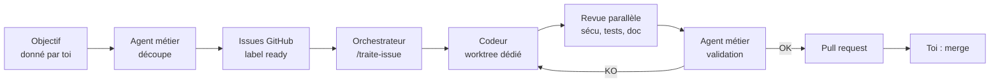
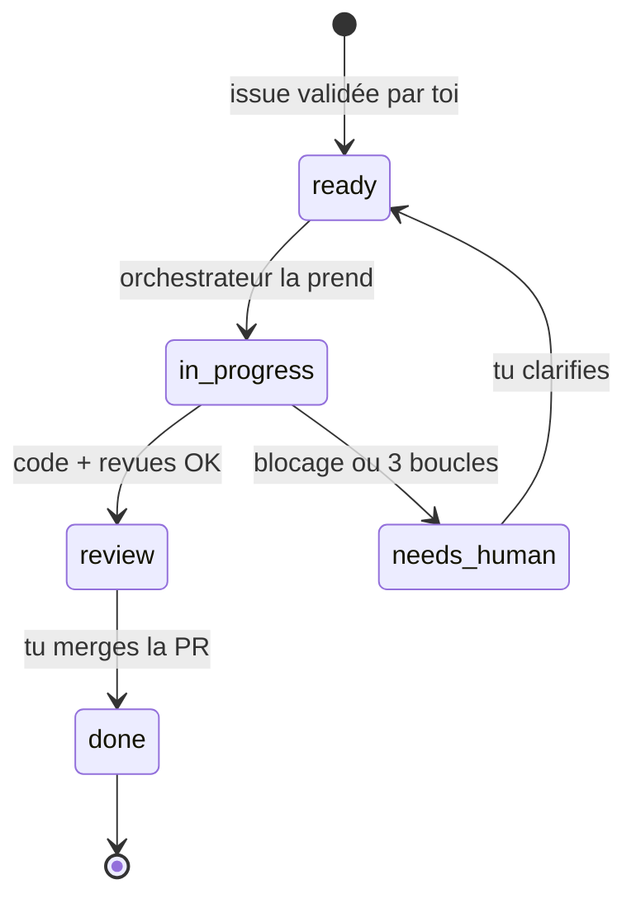

# Guide : développer avec une équipe d'agents Claude Code pilotée par les issues GitHub

2026-09-18

> **Écarts avec ce dépôt (template-agents).** Ce guide est la référence conceptuelle ; le template l'applique avec quatre différences :
> 1. Les commandes slash sont des skills : `.claude/skills/decoupe/SKILL.md` et `.claude/skills/traite-issue/SKILL.md` (et non `.claude/commands/*.md`).
> 2. Les diffs de revue utilisent `origin/main...HEAD` (les branches partent de `origin/main`).
> 3. Les commandes install/test/lint/build et les permissions correspondantes sont injectées par `setup.sh`, pas codées en dur (`npm`).
> 4. L'orchestrateur commite lui-même le travail de l'agent `doc` avant la PR, et pousse la branche courante sous son nom exact.

## Vue d'ensemble

La cible : tu donnes un objectif, un agent métier le découpe en issues GitHub, puis un orchestrateur traite chaque issue avec une équipe de subagents spécialisés, jusqu'à une PR que tu merges toi-même. GitHub reste la source de vérité : l'état de chaque issue se lit dans ses labels.



Le guide avance en six étapes, chacune testable seule. Tu peux t'arrêter après l'étape 4 et déjà travailler en mode « une issue à la fois », puis ajouter le parallélisme ensuite.

| Étape | Ce que tu obtiens | Effort estimé |
| --- | --- | --- |
| 0. Prérequis | Outillage prêt | 15 min |
| 1. CLAUDE.md + permissions | Contexte commun à tous les agents | 1 h |
| 2. Subagents | L'équipe définie dans le repo | 1 à 2 h |
| 3. Conventions GitHub | Labels et template d'issue | 30 min |
| 4. Commandes slash | Découpage et traitement d'une issue | 1 h |
| 5. Parallélisme | Plusieurs issues en même temps | 1 h |
| 6. Garde-fous | Coûts et boucles maîtrisés | 30 min |

## Étape 0 : prérequis

Il te faut Claude Code à jour, la CLI GitHub authentifiée et un repo propre. Tout le reste passe par ces deux outils.

```bash
# Vérifier / mettre à jour Claude Code
claude --version
claude update

# CLI GitHub : c'est elle que les agents utiliseront pour lire et écrire les issues
gh auth login
gh auth status

# Outils utilisés par les scripts
jq --version
git --version   # worktrees natifs, rien à installer
```

- [ ] Claude Code à jour sur ton poste
- [ ] `gh` authentifié avec les droits `repo` sur le dépôt cible
- [ ] `jq` installé
- [ ] Branche `main` protégée sur GitHub (PR obligatoire, pas de push direct) : c'est ton filet de sécurité si un agent dérape
- [ ] Une commande de tests qui passe en local (`uv run pytest`, `npm test`…), sinon l'agent tests n'a rien sur quoi s'appuyer

## Étape 1 : CLAUDE.md et permissions

Tous les agents lisent le `CLAUDE.md` à la racine : c'est lui qui évite que chacun réinvente les conventions. Garde-le court (moins de 150 lignes) et factuel.

### CLAUDE.md (racine du repo)

```markdown
# Projet <nom>

## Contexte métier
<2-3 phrases : à quoi sert l'appli, pour qui>

## Stack
- Backend : ...
- Frontend : ...
- BDD : ...

## Commandes
- Installer : `uv sync --group dev`
- Tests unitaires : `uv run pytest`
- Tests e2e : aucun
- Lint : `uv run ruff check . && uv run ruff format --check .`
- Build : aucun

## Conventions
- Branches : `issue-<num>-<slug>`
- Commits : Conventional Commits, avec `Refs #<num>`
- Pas de secret dans le code : variables d'environnement uniquement

## Workflow agents
- Une issue = une branche = un worktree = une PR
- Ne jamais pousser directement sur main. Le merge d'une PR par l'orchestrateur est autorisé uniquement après CI verte et validation métier OK ; main reste protégée par les checks CI obligatoires
- Critères d'acceptation de l'issue = définition de "fini"
- Doute sur le besoin : commenter l'issue et passer le label `needs-human`
```

### .claude/settings.json (commité)

Les permissions définissent ce que les agents peuvent faire sans te demander. L'objectif : fluide pour git, gh et les tests, bloqué pour le destructif.

```json
{
  "permissions": {
    "allow": [
      "Bash(gh issue:*)",
      "Bash(gh pr create:*)",
      "Bash(gh pr view:*)",
      "Bash(gh label:*)",
      "Bash(git status:*)",
      "Bash(git diff:*)",
      "Bash(git log:*)",
      "Bash(git add:*)",
      "Bash(git commit:*)",
      "Bash(git checkout:*)",
      "Bash(git worktree:*)",
      "Bash(git push -u origin issue-:*)",
      "Bash(uv sync:*)",
      "Bash(uv run:*)"
    ],
    "deny": [
      "Bash(git push --force:*)",
      "Bash(git push origin main:*)",
      "Bash(gh pr merge:*)",
      "Bash(rm -rf:*)",
      "Read(./.env)",
      "Read(./.env.*)",
      "Read(./secrets/**)"
    ]
  }
}
```

Ce projet utilise `uv` (voir la table des commandes ci-dessus et `CLAUDE.md`). Mets tes préférences personnelles dans `.claude/settings.local.json`, qui n'est pas commité.

## Étape 2 : créer l'équipe de subagents

Chaque agent est un fichier markdown dans `.claude/agents/`, avec un frontmatter (nom, description, outils, modèle) puis son prompt. Trois règles : le minimum d'outils, un périmètre net, et un format de sortie imposé que l'orchestrateur peut lire.

| Agent | Fichier | Outils | Modèle | Écrit du code ? |
| --- | --- | --- | --- | --- |
| Métier | `metier.md` | Read, Grep, Glob, Bash (gh) | opus | Non |
| Codeur | `codeur.md` | Tous | opus | Oui |
| Sécurité | `securite.md` | Read, Grep, Glob, Bash (git diff) | sonnet | Non |
| Tests fonctionnels | `testeur.md` | Read, Write, Edit, Grep, Glob, Bash | sonnet | Tests uniquement |
| Doc | `doc.md` | Read, Write, Edit, Grep, Glob | haiku | Doc uniquement |

Tu peux aussi les générer avec `/agents` → Create new → Project, puis coller les prompts ci-dessous.

### .claude/agents/metier.md

```markdown
---
name: metier
description: Expert métier avec la vue globale. Utilisé pour découper un objectif en issues, et pour valider qu'une implémentation répond au besoin avant PR.
tools: Read, Grep, Glob, Bash
model: opus
---
Tu es le responsable métier du projet. Tu as la vue d'ensemble : objectifs, utilisateurs, cohérence fonctionnelle.

MODE DÉCOUPAGE (quand on te donne un objectif) :
- Découpe en issues indépendantes, livrables en moins d'une journée de dev chacune.
- Chaque issue suit le template : Contexte / Besoin / Critères d'acceptation (Given-When-Then) / Hors périmètre / Dépendances.
- Indique l'ordre et les dépendances entre issues.
- Ne crée rien toi-même : renvoie la liste pour validation humaine.

MODE VALIDATION (quand on te donne une issue et un diff) :
- Vérifie chaque critère d'acceptation un par un.
- Vérifie la cohérence avec l'objectif global et les autres fonctionnalités.
- Tu ne modifies jamais le code.

Format de sortie obligatoire en validation :
VERDICT: OK | KO | NEEDS_HUMAN
CRITERES: liste "✓/✗ critère"
REMARQUES: actions précises pour le codeur si KO
```

### .claude/agents/codeur.md

```markdown
---
name: codeur
description: Développeur qui implémente une issue GitHub dans le worktree courant. À utiliser pour tout travail d'implémentation ou de correction suite à une revue.
model: opus
---
Tu implémentes UNE issue, dans le worktree courant, sur sa branche.

- Lis l'issue (gh issue view <num>) et le CLAUDE.md avant de coder.
- Reste strictement dans le périmètre de l'issue ; note le reste en "hors périmètre".
- Écris ou mets à jour les tests unitaires de ce que tu codes.
- Lance lint + tests unitaires avant de rendre la main ; ils doivent passer.
- Commits atomiques en Conventional Commits avec "Refs #<num>".
- Si tu reçois des remarques de revue, traite-les toutes et liste ce que tu as changé.
- Tu ne pousses jamais sur main et tu ne merges jamais.

Format de sortie :
STATUT: DONE | BLOQUÉ
FICHIERS: liste
TESTS: résultat
NOTES: points d'attention pour la revue
```

### .claude/agents/securite.md

```markdown
---
name: securite
description: Auditeur sécurité. À utiliser systématiquement après une implémentation, avant PR.
tools: Read, Grep, Glob, Bash
model: sonnet
---
Tu audites uniquement le diff de la branche courante (git diff main...HEAD). Tu ne modifies jamais de fichier.

Cherche en priorité : secrets en dur, injections (SQL, commande, template), authentification/autorisation manquante, validation d'entrées, données personnelles loguées ou exposées, dépendances ajoutées et leur réputation, configuration permissive (CORS, headers).

Format de sortie obligatoire :
VERDICT: OK | A_CORRIGER | BLOQUANT
CONSTATS: "fichier:ligne — gravité — problème — correction suggérée"
```

### .claude/agents/testeur.md

```markdown
---
name: testeur
description: Testeur fonctionnel. Écrit et exécute les tests fonctionnels / e2e qui prouvent les critères d'acceptation d'une issue.
tools: Read, Write, Edit, Grep, Glob, Bash
model: sonnet
---
Tu prouves que les critères d'acceptation de l'issue sont remplis.

- Un test fonctionnel (ou e2e) par critère Given-When-Then.
- Tu n'écris que dans les dossiers de tests ; tu ne corriges jamais le code applicatif.
- Exécute toute la suite : tes tests + l'existant (non-régression).

Format de sortie obligatoire :
VERDICT: OK | KO
COUVERTURE: "critère → test → ✓/✗"
ÉCHECS: détail et hypothèse de cause pour le codeur
```

### .claude/agents/doc.md

```markdown
---
name: doc
description: Rédacteur technique. Met à jour la documentation après une implémentation validée.
tools: Read, Write, Edit, Grep, Glob
model: haiku
---
Tu mets à jour la documentation impactée par le diff : README, docs/, CHANGELOG, docstrings des fonctions publiques.

- N'écris que dans les fichiers de doc et les commentaires.
- Pas de doc sur ce qui n'a pas changé.
- Ajoute une entrée CHANGELOG sous "Unreleased".

Format de sortie :
FICHIERS_MODIFIÉS: liste
RÉSUMÉ: une phrase
```

## Étape 3 : conventions GitHub

Les labels servent de machine à états : l'orchestrateur ne prend que les issues `ready`, et tu vois l'avancement de toute l'équipe depuis GitHub.



### Créer les labels (une seule fois par repo)

```bash
gh label create ready        --color 0E8A16 --description "Prête pour les agents"
gh label create in-progress  --color FBCA04 --description "Prise par un agent"
gh label create review       --color 1D76DB --description "PR ouverte, attend ton merge"
gh label create needs-human  --color D93F0B --description "Bloquée, décision humaine requise"
gh label create epic         --color 5319E7 --description "Objectif parent"
```

### Template d'issue : .github/ISSUE_TEMPLATE/agent-task.md

La qualité des critères d'acceptation détermine celle de tout le reste : c'est ce que le testeur transforme en tests et ce que le métier vérifie.

```markdown
---
name: Tâche agent
about: Issue destinée à l'équipe d'agents
labels: ''
---
## Contexte
Pourquoi cette issue existe. Lien vers l'epic : #<num>

## Besoin
Ce que l'utilisateur doit pouvoir faire.

## Critères d'acceptation
- [ ] GIVEN ... WHEN ... THEN ...
- [ ] GIVEN ... WHEN ... THEN ...

## Hors périmètre
- ...

## Dépendances
Bloquée par : #<num> (ou aucune)
```

L'objectif global vit dans une issue `epic` ; chaque issue enfant y renvoie. L'agent métier relit l'epic quand il valide, c'est ce qui lui donne la « vue totale ».

## Étape 4 : les commandes d'orchestration

Deux commandes slash suffisent : `/decoupe` transforme un objectif en issues, `/traite-issue` fait passer une issue dans toute la chaîne. C'est la session principale de Claude Code qui joue l'orchestrateur et délègue aux subagents.

### .claude/commands/decoupe.md

```markdown
---
description: Découpe un objectif en issues GitHub via l'agent métier
argument-hint: <objectif en une phrase ou chemin vers un brief>
---
Objectif : $ARGUMENTS

1. Lis le CLAUDE.md et explore rapidement le code pour comprendre l'existant.
2. Demande à l'agent `metier` de découper l'objectif en MODE DÉCOUPAGE.
3. Affiche-moi la liste proposée (titre, critères, dépendances, ordre) et ATTENDS ma validation.
4. Après validation :
   - crée une issue epic avec l'objectif (label `epic`),
   - crée chaque issue avec le template agent-task, en liant l'epic,
   - mets le label `ready` uniquement sur les issues sans dépendance ouverte.
5. Résume : numéros créés et ordre conseillé.
```

### .claude/commands/traite-issue.md

```markdown
---
description: Fait passer une issue dans toute la chaîne d'agents jusqu'à la PR
argument-hint: <numéro d'issue>
---
Issue à traiter : #$ARGUMENTS

## 1. Prise en charge
- `gh issue view $ARGUMENTS` : lis l'issue et son epic.
- Vérifie le label `ready`, sinon arrête-toi et dis pourquoi.
- Remplace `ready` par `in-progress`.
- Si tu n'es pas déjà dans un worktree dédié, crée la branche `issue-$ARGUMENTS-<slug>`.

## 2. Implémentation
- Délègue à l'agent `codeur`.

## 3. Revue parallèle
- Lance EN PARALLÈLE les agents `securite` et `testeur` sur la branche.

## 4. Validation métier
- Donne à l'agent `metier` (MODE VALIDATION) l'issue, l'epic, le diff et les rapports sécu + tests.

## 5. Boucle de correction
- Si sécu = BLOQUANT/A_CORRIGER, tests = KO ou métier = KO : renvoie TOUTES les remarques au `codeur`, puis refais les étapes 3 et 4.
- Maximum 3 itérations. Au-delà, ou si métier = NEEDS_HUMAN : commente l'issue avec le blocage, label `needs-human`, arrête-toi.

## 6. Finalisation
- Délègue à l'agent `doc`.
- Push la branche, ouvre la PR avec `gh pr create` : titre, "Closes #$ARGUMENTS", puis une section par agent (verdict + points clés).
- Remplace `in-progress` par `review`.
- Ne merge jamais.
```

### Test à la main

```bash
claude
> /decoupe Ajouter l'export CSV des séances dans CoachFit
# tu valides la liste, les issues sont créées
> /traite-issue 42
```

Fais tourner deux ou trois issues ainsi, en regardant ce que chaque agent produit. C'est là que tu ajustes les prompts avant d'automatiser.

## Étape 5 : parallélisme avec worktrees

Pour traiter plusieurs issues en même temps, chaque issue a son propre worktree git (un dossier séparé, une branche) et sa propre session Claude Code en mode non interactif (`claude -p`). Sans worktree, deux codeurs modifient les mêmes fichiers et se cassent mutuellement le travail.

### scripts/agents-run.sh

```bash
#!/usr/bin/env bash
# Traite les issues "ready" en parallèle, une session Claude Code par worktree.
set -euo pipefail

MAX_PARALLEL=${MAX_PARALLEL:-3}
REPO_ROOT=$(git rev-parse --show-toplevel)
WT_DIR="$REPO_ROOT/../$(basename "$REPO_ROOT")-worktrees"
LOG_DIR="$REPO_ROOT/.agents-logs"
mkdir -p "$WT_DIR" "$LOG_DIR"

git fetch origin main

ISSUES=$(gh issue list --label ready --state open --limit "$MAX_PARALLEL" \
  --json number,title --jq '.[] | "\(.number)|\(.title)"')

[ -z "$ISSUES" ] && { echo "Aucune issue ready."; exit 0; }

while IFS='|' read -r NUM TITLE; do
  SLUG=$(echo "$TITLE" | tr '[:upper:]' '[:lower:]' | tr -cs 'a-z0-9' '-' | cut -c1-40 | sed 's/-$//')
  BRANCH="issue-$NUM-$SLUG"
  WT="$WT_DIR/issue-$NUM"

  echo "→ #$NUM dans $WT"
  git worktree add -b "$BRANCH" "$WT" origin/main

  (
    cd "$WT"
    # installer les dépendances si besoin : uv sync --group dev
    claude -p "/traite-issue $NUM" \
      --permission-mode acceptEdits \
      --max-turns 150 \
      --output-format json > "$LOG_DIR/issue-$NUM.json" 2>&1
    echo "✓ #$NUM terminée (voir $LOG_DIR/issue-$NUM.json)"
  ) &
done <<< "$ISSUES"

wait
echo "Toutes les sessions sont terminées."
```

```bash
chmod +x scripts/agents-run.sh
MAX_PARALLEL=2 ./scripts/agents-run.sh
```

Ajoute `.agents-logs/` au `.gitignore`. Après merge d'une PR, nettoie son worktree :

```bash
git worktree remove ../<repo>-worktrees/issue-42
git branch -d issue-42-<slug>
```

### Deux points de vigilance

- **Issues indépendantes seulement** : le script ne prend que les `ready`, et `/decoupe` ne met `ready` que sur les issues sans dépendance ouverte. Quand tu merges une PR, repasse en `ready` les issues qu'elle débloquait.
- **Commence à 2 en parallèle**, pas plus : tu dois pouvoir relire les PR au rythme où elles arrivent, sinon tu deviens le goulot d'étranglement.

### Option : exécution dans GitHub plutôt que sur ton poste

L'action GitHub officielle de Claude Code (`anthropics/claude-code-action`) peut lancer la même chaîne sur un runner, déclenchée par un label ou une mention `@claude` dans l'issue. Intéressant une fois le flux stabilisé en local ; vérifie sa documentation pour la configuration à jour.

## Étape 6 : garde-fous

Quatre protections couvrent l'essentiel des dérapages : main protégée, permissions `deny`, limite de boucles et un hook qui bloque les commits hors branche d'issue. Les trois premières sont déjà en place si tu as suivi les étapes précédentes.

### Hook : interdire tout commit en dehors d'une branche issue-*

Les hooks s'exécutent de façon déterministe, quoi que décide le modèle. À ajouter dans `.claude/settings.json`, à côté de `permissions` :

```json
"hooks": {
  "PreToolUse": [
    {
      "matcher": "Bash",
      "hooks": [
        { "type": "command", "command": "$CLAUDE_PROJECT_DIR/.claude/hooks/guard-branch.sh" }
      ]
    }
  ]
}
```

`.claude/hooks/guard-branch.sh` (rendre exécutable) :

```bash
#!/usr/bin/env bash
# Reçoit l'appel d'outil en JSON sur stdin ; code de sortie 2 = action bloquée.
CMD=$(jq -r '.tool_input.command // ""')
if echo "$CMD" | grep -qE '^git (commit|push)'; then
  BRANCH=$(git rev-parse --abbrev-ref HEAD)
  if [[ ! "$BRANCH" =~ ^issue- ]]; then
    echo "Commit/push refusé : branche '$BRANCH' n'est pas une branche d'issue." >&2
    exit 2
  fi
fi
exit 0
```

### Maîtriser les coûts

| Levier | Où | Effet |
| --- | --- | --- |
| Modèle par agent | frontmatter `model:` | Opus seulement pour codeur et métier |
| `--max-turns` | script headless | Coupe une session qui tourne en rond |
| 3 itérations max | `/traite-issue` | Évite les boucles codeur ↔ revue |
| `MAX_PARALLEL` | script | Plafonne le nombre de sessions simultanées |
| Issues petites | `/decoupe` | Moins de contexte, moins d'allers-retours |

Suis la consommation réelle avec `/cost` en interactif, ou dans le JSON de sortie des sessions headless, pendant les premières semaines.

### Plus tard : les agent teams

Les agent teams (sessions Claude Code qui se parlent entre elles via une liste de tâches partagée) sont encore expérimentales et s'activent avec la variable `CLAUDE_CODE_EXPERIMENTAL_AGENT_TEAMS=1`. Garde-les pour des cas précis, comme un débat métier contre sécurité sur une issue ambiguë, une fois le flux subagents stable.

## Plan de déploiement et checklist

Déploie sur un projet perso à faible enjeu avant tout repo d'entreprise, et n'automatise qu'une fois le mode manuel fiable.

| Semaine | Objectif | Critère pour passer à la suite |
| --- | --- | --- |
| 1 | Étapes 0 à 3 + `/traite-issue` à la main sur 3 issues | Les verdicts des agents sont pertinents |
| 2 | `/decoupe` sur un vrai objectif, puis traitement une par une | Moins d'une issue sur trois en `needs-human` |
| 3 | Script parallèle avec `MAX_PARALLEL=2` | Tu relis les PR au rythme où elles arrivent |
| 4+ | Hook, suivi des coûts, éventuellement GitHub Actions | Coût par issue connu et acceptable |

### Checklist de mise en place

- [ ] Claude Code à jour, `gh` et `jq` installés, main protégée
- [ ] `CLAUDE.md` écrit avec les vraies commandes du projet
- [ ] `.claude/settings.json` avec permissions `allow` / `deny`
- [ ] 5 fichiers dans `.claude/agents/`
- [ ] Labels créés et template `agent-task` en place
- [ ] `.claude/commands/decoupe.md` et `traite-issue.md`
- [ ] Première issue traitée à la main de bout en bout
- [ ] Prompts d'agents ajustés après 3 issues
- [ ] `scripts/agents-run.sh` testé avec 2 issues
- [ ] Hook `guard-branch.sh` actif

Après chaque PR, note ce qu'un agent a raté et corrige son prompt ou le `CLAUDE.md` : c'est cette boucle d'amélioration qui rend l'équipe fiable dans la durée.
